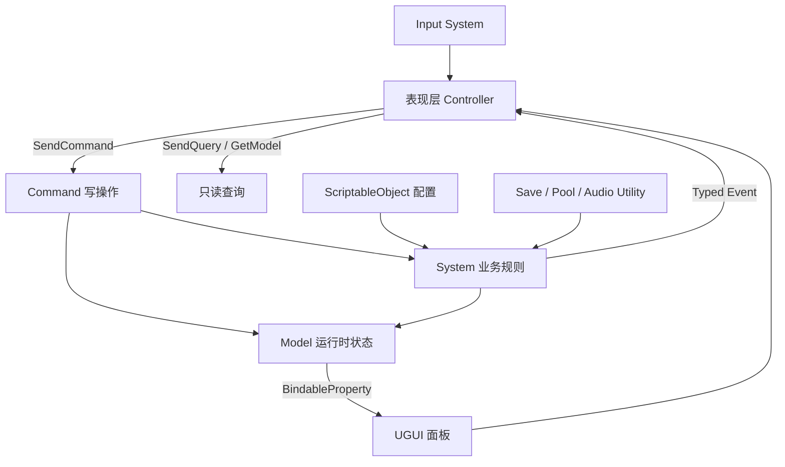

# LowPolyGame RPG 开发计划书

> 文档版本：1.0  
> 制定日期：2026-08-16  
> 当前引擎：Unity 2023.2.20f1c1  
> 项目类型：第三人称 Low Poly 动作 RPG  
> 适用阶段：基础移动与战斗原型完成后，进入核心玩法垂直切片开发

## 1. 项目目标

本项目的目标不是堆叠大量地图和内容，而是完成一个结构清晰、功能闭环、可扩展且适合作为技术作品展示的经典动作 RPG 原型。

最终应形成以下完整体验链路：

1. 玩家探索场景，与 NPC 对话并接受任务。
2. 玩家进入战斗，使用普通攻击、重攻击和 1 至 2 个主动技能击败敌人。
3. 敌人掉落物品，玩家通过背包查看、使用或装备物品。
4. 任务系统监听击杀、收集、交互等事件并推进进度。
5. HUD、背包、技能、任务、对话、暂停和设置界面构成统一 UI 体系。
6. 角色属性、背包、装备、技能、任务和世界进度可以正确保存与读取。

### 1.1 MVP 完成标准

首个可交付版本只要求完成一条 15 至 30 分钟的可玩流程：

- 1 个可探索小型场景。
- 1 个玩家角色，支持键鼠和手柄基础操作。
- 2 种普通敌人，至少 1 种敌人具备完整巡逻、追击、攻击和死亡流程。
- 普通攻击连段、现有重攻击连段、2 个主动技能。
- 8 至 12 种物品，包含消耗品、武器、装备和任务物品。
- 1 条主任务和 1 条支线任务。
- 1 个带分支或条件判断的 NPC 对话。
- 完整 HUD、背包、任务、对话、暂停与设置界面。
- 至少 3 个存档槽，支持版本检查和自动存档。

### 1.2 暂不纳入首个版本

- 开放世界与无缝大地图。
- 联机、PVP、服务器权威逻辑。
- 随机词条、复杂锻造、交易行等大型经济系统。
- 大规模技能树和数十种装备套装。
- 复杂程序化生成关卡。

## 2. 当前项目评估

### 2.1 已具备的基础

- Input System 输入封装，已有键鼠和手柄绑定基础。
- CharacterController 角色移动、行走/奔跑转向和动画参数驱动。
- Cinemachine 探索 FreeLook、战斗相机、锁定与防穿墙。
- 持武器/未持武器双动画树。
- 三段重攻击输入缓冲和连击窗口。
- QFramework `Architecture / Model / System / Command / Event` 基础链路。
- `GameStateModel`、`GameStateSystem`、`ChangeGameStateCommand` 示例实现。

### 2.2 尚处于占位阶段的模块

以下脚本目前主要是职责说明或空壳，不能视为已完成模块：

- 伤害、命中检测、Buff、投射物。
- 玩家属性、背包、技能、任务。
- 敌人属性、AI、动画、生成器。
- 物品、技能、敌人和存档数据定义。
- HUD、背包、技能树、任务、对话和通用 UI 管理。
- 配置加载、存档、对象池、音频和场景加载。

### 2.3 当前需要优先处理的工程问题

- `README.md` 标注 Unity 6，但项目实际为 Unity 2023.2，需要后续统一文档口径。
- 多个占位脚本存在文本编码乱码，正式实现前应统一保存为 UTF-8。
- 现有 QFramework 只注册了游戏状态模块，后续业务模块必须逐步接入，不能同时保留两套互相竞争的数据源。
- `EventManager` 字符串事件仅作为兼容层；新业务必须使用 QFramework 类型事件。
- 现有多个 `Manager` 是空壳。不能默认全部实现为 `DontDestroyOnLoad` 单例，否则会形成全局状态污染和难以测试的依赖关系。

## 3. 总体架构方案

### 3.1 架构风格

项目继续以 QFramework 为应用架构核心，采用“分层架构 + 数据驱动 + 事件驱动 + 显式状态机”的组合方案。



依赖方向必须保持单向：

`UI/MonoBehaviour -> Command/System -> Model -> Utility/纯数据`

下层不得反向持有具体 UI、玩家对象或场景对象。需要通知表现层时使用类型事件或只读绑定。

### 3.2 各层职责

| 层级 | QFramework 角色 | 职责 | 禁止事项 |
|---|---|---|---|
| 表现层 | `IController` | 输入、动画、特效、UI、Unity 生命周期适配 | 直接修改核心 Model |
| 命令层 | `AbstractCommand` | 表达一次用户意图或状态变更 | 保存长期状态、直接操作 UI |
| 系统层 | `AbstractSystem` | 战斗、技能、背包、任务等业务规则 | 依赖具体场景对象或面板 |
| 数据层 | `AbstractModel` | 保存运行时状态和可观察属性 | 编写复杂流程和表现逻辑 |
| 工具层 | `IUtility` | 序列化、文件、对象池、配置索引等基础设施 | 包含具体玩法规则 |
| 配置层 | `ScriptableObject` | 策划可编辑的静态定义 | 保存运行时可变状态 |

### 3.3 推荐目录与程序集

随着代码增长，将脚本按业务模块拆分，并使用 Assembly Definition 限制依赖：

```text
Assets/Scripts/
├── Core/                  # Architecture、公共类型、通用接口
├── Input/                 # Input System 适配层
├── Character/             # 玩家/敌人共享的属性与战斗接口
├── Combat/                # 伤害、攻击、技能、Buff、命中
├── Inventory/             # 背包、装备、物品
├── Quest/                 # 任务定义、目标、进度
├── Dialogue/              # 对话图、条件、动作
├── Camera/                # 相机模式与锁定
├── UI/                    # HUD 与各面板
├── Save/                  # 快照、迁移、存储
└── Infrastructure/        # 配置、对象池、音频、场景加载
```

建议先完成模块接口和命名空间整理，再添加 `.asmdef`。不要在代码仍频繁跨目录引用时一次性拆出过多程序集。

## 4. 设计模式使用策略

设计模式用于明确边界和变化点，不应为了“看起来高级”而机械套用。

| 模式 | 项目中的应用 | 适用原因 |
|---|---|---|
| 观察者模式 | QFramework 类型事件、`BindableProperty`、UI 数据刷新 | 消除战斗/任务/背包与 UI 的直接引用 |
| 命令模式 | 攻击、使用物品、装备、接取任务、保存游戏 | 统一写入口，便于校验、记录和测试 |
| 状态模式/有限状态机 | 玩家战斗状态、敌人 AI、游戏全局状态、对话播放状态 | 明确进入、更新、退出和可切换条件 |
| 策略模式 | 伤害公式、技能效果、Buff 效果、任务目标 | 使用相同接口组合不同规则，避免巨型 `switch` |
| 工厂模式 | 敌人、投射物、掉落物、UI 条目创建 | 隔离实例创建和资源来源 |
| 对象池模式 | 投射物、命中特效、伤害数字、掉落提示 | 降低频繁 Instantiate/Destroy 的 GC 和卡顿 |
| 外观模式 | `InputManager`、`SaveService`、`AudioService` | 向业务层隐藏 Unity API 和第三方实现细节 |
| 适配器模式 | Animator、Cinemachine、Input System、NavMesh | 让业务逻辑不直接依赖组件细节 |
| 组合模式 | 技能效果列表、任务条件、对话条件与动作 | 复杂内容由多个小效果组合而成 |
| 仓储模式 | 物品/技能/任务配置查询，存档槽读写 | 业务层只依赖查询接口，不关心数据来源 |
| 备忘录/快照模式 | 存档 DTO 与各模块 Save Section | 将运行时状态转换为可序列化快照 |
| 单例模式 | 仅 `GameArchitecture.Interface` 和极少数跨场景入口 | 控制唯一入口；禁止把所有 Manager 都做成单例 |

### 4.1 必须避免的反模式

- 巨型 `GameManager` 同时管理战斗、UI、存档和场景。
- UI 直接写玩家属性或背包集合。
- 使用字符串名称驱动核心事件、技能或任务逻辑。
- 每个技能创建一个高度重复的 MonoBehaviour 脚本。
- 在 ScriptableObject 中保存当前血量、当前数量、冷却时间等运行时状态。
- 业务代码中大量使用 `FindObjectOfType`、`GameObject.Find` 或硬编码资源路径。
- 用 Animator 当前状态作为唯一的战斗真相；战斗状态应由明确的运行时状态机维护，Animator 只负责表现。

## 5. 核心模块技术设计

### 5.1 战斗与角色属性

战斗是后续所有系统的依赖中心，应最先形成稳定闭环。

#### 数据与接口

- `CharacterStatsModel`：最大生命、当前生命、攻击、防御、暴击、移动速度等运行时状态。
- `CharacterStatsSnapshot`：敌人或玩家某一时刻的只读战斗属性快照。
- `DamageRequest`：攻击者、目标、基础值、倍率、伤害类型、命中点、技能 ID。
- `DamageResult`：最终伤害、是否暴击、是否格挡、是否击杀。
- `IDamageable`：接受伤害和查询存活状态。
- `ITargetable`：锁定系统识别目标的统一接口。
- `Team/Faction`：阵营过滤，禁止依赖 Tag 判断敌我关系。

#### 处理流程

```text
输入 -> AttackCommand -> CombatSystem 校验状态
-> 播放攻击状态 -> Animation Event 开关 Hitbox
-> HitDetection 收集 IDamageable
-> DamageSystem 生成 DamageResult
-> 修改 StatsModel -> 发送 DamageAppliedEvent
-> 动画/音效/伤害数字/HUD 分别响应
```

#### 普通攻击

- 普通攻击建议支持 3 段轻攻击连段，复用现有重攻击的输入缓冲思想。
- 使用独立的 `AttackDefinition` 配置伤害倍率、前摇、有效帧、后摇、位移和可取消窗口。
- 攻击状态使用显式 `CombatState`：`Idle / Attacking / Casting / HitStun / Dead`。
- 动画事件只负责通知命中框开关、特效和脚步等时间点，不直接计算伤害。

#### 技能

- 使用 `SkillDefinition : ScriptableObject` 保存静态配置。
- 运行时使用 `SkillRuntime` 保存等级、冷却和当前施法状态。
- 技能由多个 `SkillEffect` 策略组合，例如伤害、治疗、位移、Buff、生成投射物。
- 首版实现两个技能：一个近战范围技能，一个投射物或冲刺技能，以验证不同执行器。
- 技能释放统一经过 `CastSkillCommand`，由 `SkillSystem` 检查冷却、资源、状态和目标。

#### Buff

- `BuffDefinition` 保存持续时间、叠层规则、图标和效果列表。
- `BuffRuntime` 保存来源、剩余时间和层数。
- 定时伤害使用集中 Tick 调度，不为每个 Buff 启动独立协程。

### 5.2 敌人 AI

- 使用 NavMesh 负责寻路，有限状态机负责决策。
- 基础状态：`Idle / Patrol / Alert / Chase / Attack / Hit / Return / Dead`。
- 状态对象实现统一的 `Enter / Tick / Exit` 接口，`EnemyBrain` 只管理切换。
- 感知层独立处理视野、距离、受击仇恨和目标丢失，不把感知判断散落在各状态中。
- 攻击选择使用策略模式，可根据距离、冷却和权重选择技能。
- 首版 AI 不需要行为树；当 Boss 行为出现多层组合和并行条件后，再评估行为树。

### 5.3 相机与操作手感

- 保留探索 FreeLook 与战斗锁定相机双模式。
- 鼠标/右摇杆输入优先，移动时延迟回正保持当前实现。
- 下一轮优化重点：镜头遮挡透明化、锁定目标切换、锁定距离/角度限制、冲刺和技能时的镜头反馈。
- 相机震动抽象为 `ICameraImpulseService`，由攻击命中事件触发，避免战斗系统直接操作 Cinemachine。
- 所有速度、延迟和阈值保留为配置参数，并建立固定测试场景调整手感。

### 5.4 背包与装备

#### 数据模型

- `ItemDefinition : ScriptableObject`：ID、名称、图标、类型、品质、最大堆叠和静态效果。
- `ItemStack`：物品 ID、数量和实例 ID。
- `EquipmentInstance`：实例 ID、物品 ID、耐久或随机属性；首版可不做随机词条。
- `InventoryModel`：固定容量槽位、金币、装备槽和只读查询。

#### 写操作

- `AddItemCommand`
- `RemoveItemCommand`
- `UseItemCommand`
- `EquipItemCommand`
- `UnequipItemCommand`
- `MoveInventorySlotCommand`

命令负责统一检查容量、堆叠、装备类型和数量，成功后发送类型事件。UI 不直接修改列表。

#### UI 与交互

- 背包使用可复用槽位组件和对象池。
- 点击选择、双击使用、装备比较和手柄焦点导航必须共用同一套 Selection 状态。
- 拖拽只是发送移动命令的表现方式，不直接交换数据。

### 5.5 任务系统

- `QuestDefinition : ScriptableObject` 保存标题、描述、前置条件、目标和奖励。
- `QuestRuntime` 保存状态与每个目标的进度。
- 状态：`Locked / Available / Active / ReadyToTurnIn / Completed / Failed`。
- 任务目标采用策略模式：击杀、收集、交互、到达区域、对话和自定义目标。
- `QuestSystem` 监听 `EnemyKilledEvent`、`ItemChangedEvent`、`InteractEvent` 等领域事件推进进度。
- 奖励通过 `CompleteQuestCommand` 发放，确保物品、金币和经验变化具备统一入口。
- 任务定义引用稳定 ID，不保存场景 GameObject 引用。

### 5.6 对话系统

- 使用数据驱动的节点图结构：文本节点、选项节点、条件节点、动作节点、结束节点。
- `DialogueDefinition` 保存 NPC 信息和节点集合，`DialogueRuntime` 只保存当前节点与上下文。
- 条件与动作采用组合/策略模式，例如检查任务状态、持有物品、修改任务、发放奖励。
- 对话播放时切换 `GameState.Cutscene` 或独立输入上下文，禁用移动但保留 UI 操作。
- 首版可先用 ScriptableObject 列表编辑；内容量明显增加后再制作自定义节点编辑器。
- 不建议首版直接引入大型第三方对话框架，以免与 QFramework 状态和任务系统形成双重数据源。

### 5.7 UI 系统

项目已有 UGUI，应继续使用 UGUI 完成首版，避免中途切换 UI Toolkit。

#### UI 架构

- `UIService` 管理面板注册、打开、关闭、返回栈和层级。
- `UIPanel` 提供 `Open / Refresh / Close` 生命周期模板。
- UI 状态分层：`HUD / Screen / Popup / Overlay`。
- HUD 使用 `BindableProperty` 或类型事件增量更新，不在 `Update` 中轮询全部 Model。
- 面板打开时注册监听，关闭或销毁时自动解除。
- 输入使用 Input System 的 UI Action Map；打开菜单时切换输入上下文和鼠标状态。

#### 首版面板清单

- HUD：生命、资源、技能冷却、锁定目标、交互提示、任务追踪。
- 背包/装备。
- 任务日志。
- 对话界面。
- 暂停、设置、存档选择和确认弹窗。
- 伤害数字、拾取提示和通用 Toast。

#### 手柄要求

- 所有主要面板必须设置默认选中项。
- 支持方向导航、确认、取消、分页和返回。
- 键鼠与手柄切换时刷新按钮提示图标，不改变业务逻辑。

### 5.8 存档系统

- 使用版本化 JSON 存档；开始开发该模块时引入 `com.unity.nuget.newtonsoft-json`，不要依赖 `JsonUtility` 处理复杂字典和多态数据。
- 存档采用模块快照：玩家、背包、技能、任务、世界状态分别生成自己的 Save Section。
- `SaveService` 只负责序列化、文件路径、校验和原子写入。
- `SaveSystem` 负责收集各模块快照和恢复顺序。
- 写入时先生成临时文件，成功后替换正式文件，避免中途退出损坏存档。
- 保存 `schemaVersion`，为字段变更提供迁移器。
- 配置使用稳定字符串或整数 ID，严禁保存 Unity 对象引用、InstanceID 或场景临时索引。
- 设置项与游戏存档分离：设置可使用 PlayerPrefs，游戏进度使用 JSON 文件。

### 5.9 配置与资源管理

- 首版静态数据使用 ScriptableObject，建立统一 ID 校验工具。
- `ConfigRepository` 在启动时建立 ID 到配置对象的只读索引。
- 制作 Editor 校验命令，检查重复 ID、空图标、无效引用和循环依赖。
- 当需要异步加载场景、图标和大量可选内容时再引入 Addressables；首版小规模内容不必提前增加复杂度。
- 特效、投射物、伤害数字和背包格子接入对象池。

## 6. 开发里程碑

以下周期按单人、每周有稳定开发时间估算。应以“功能闭环和验收条件”作为完成标准，而不是只以脚本存在作为完成。

| 阶段 | 建议周期 | 目标 | 关键交付物 |
|---|---:|---|---|
| M0 架构加固 | 1 周 | 清理技术债并建立接口边界 | UTF-8、命名空间、基础接口、测试目录、模块注册规则 |
| M1 战斗垂直切片 | 2 至 3 周 | 形成可重复战斗闭环 | 属性、伤害、命中、轻/重攻击、受击、死亡、掉落 |
| M2 技能与战斗手感 | 2 周 | 完成 2 个不同类型技能 | 技能配置、冷却、资源、效果策略、HUD 冷却显示 |
| M3 敌人 AI | 2 周 | 完成普通敌人完整行为 | NavMesh FSM、感知、攻击、死亡、生成和回收 |
| M4 背包与装备 | 2 至 3 周 | 完成拾取到装备的闭环 | InventoryModel、装备属性、背包 UI、手柄导航 |
| M5 任务与对话 | 2 至 3 周 | 完成 NPC 到奖励的流程 | 任务目标策略、对话节点、任务 UI、奖励发放 |
| M6 存档与整体 UI | 2 周 | 支持完整流程保存恢复 | 多槽位、版本迁移、暂停/设置/存档 UI |
| M7 内容整合与优化 | 2 周 | 完成可发布演示版本 | 场景流程、音效、对象池、性能分析、Build |

推荐总周期：15 至 18 周。若开发时间有限，优先保证 M0 至 M5 形成完整演示，技能树、复杂 Buff 和额外敌人可延后。

## 7. 每阶段验收标准

### M0 架构加固

- 新业务不再使用字符串事件。
- 明确 Model/System/Command/Controller 的命名与注册规范。
- 建立 EditMode 和 PlayMode 测试目录。
- 清理正式模块中的乱码和明显失效占位代码。
- 核心模块之间通过接口或事件通信，无新增随意单例。

### M1 战斗垂直切片

- 同一次攻击不会对同一目标重复结算。
- 受击、死亡和无敌状态具有明确切换规则。
- 伤害结果可被 HUD、音效、特效和任务系统分别监听。
- 攻击中移动、转向、取消和输入缓冲规则可配置且一致。

### M2 技能

- 冷却、消耗、状态限制和命中均由业务层校验。
- 两个技能共享执行框架，但使用不同效果组合。
- 技能 UI 不保存独立冷却真相，只显示 SkillRuntime 数据。

### M3 敌人

- 敌人能够从巡逻进入追击、攻击、返回和死亡。
- NavMesh 失败、目标消失和超出活动区域时不会卡死。
- 敌人死亡后停止感知、寻路和攻击，并正确进入掉落/回收流程。

### M4 背包

- 堆叠、容量、使用、装备、卸下和交换槽位都有失败返回结果。
- 属性加成可随装备变化正确添加和移除，不产生重复叠加。
- 键鼠和手柄都能完成完整背包操作。

### M5 任务与对话

- 击杀、收集和对话目标至少各有一个可运行案例。
- 存档读取后任务状态和进度保持一致。
- 对话条件和动作不直接依赖具体 UI 或场景对象。

### M6 存档与 UI

- 正常存档、覆盖、删除、损坏文件回退和版本不匹配均有明确结果。
- 读取后角色、背包、装备、技能、任务和世界状态一致。
- 暂停、对话和菜单输入上下文不会互相冲突。

## 8. 测试与质量策略

### 8.1 自动化测试

EditMode 测试优先覆盖纯业务规则：

- 伤害公式、暴击和防御边界。
- 物品堆叠、容量和装备约束。
- 技能冷却和资源消耗。
- 任务目标推进与奖励只能领取一次。
- 存档序列化往返和版本迁移。

PlayMode 测试覆盖 Unity 组件协作：

- 攻击动画事件开启命中框并造成一次伤害。
- 相机模式切换、锁定和移动回正。
- AI 状态切换与 NavMesh 移动。
- UI 面板打开/关闭与 Input Action Map 切换。

### 8.2 手工回归场景

建立独立 `GameplayTest` 场景，固定放置：

- 玩家出生点与相机测试障碍。
- 静止木桩、移动敌人和可锁定目标。
- 技能冷却和伤害数据显示区。
- 拾取物、NPC、任务触发器和存档点。

每个核心迭代结束后用同一场景回归，减少因正式关卡变化导致的验证成本。

### 8.3 Definition of Done

一个功能只有满足以下条件才算完成：

- 代码已编译，无 Console Error。
- 核心成功路径和至少一个失败路径已验证。
- 配置字段有合理默认值和范围限制。
- 不存在未解除的事件监听或无限增长集合。
- 键鼠流程可用；属于主要交互时，手柄流程也必须可用。
- 相关数据能保存时，已纳入存档快照。
- 文档或开发清单已同步更新。

## 9. 性能与工程规范

- 核心战斗循环避免 LINQ、频繁装箱和每帧分配集合。
- 感知、任务检查和 Buff Tick 不必全部每帧执行，应采用分帧或固定间隔更新。
- 使用 Physics NonAlloc API 或复用缓冲区处理范围检测。
- 高频对象使用对象池；普通面板和低频 NPC 不必过度池化。
- 使用 Unity Profiler、Memory Profiler 和 Frame Debugger 以数据决定优化点。
- 公共 API 使用清晰的领域命名，避免 `Manager.DoSomething()` 式模糊接口。
- 每个类只承担一个明确职责；超过约 300 行且包含多个变化原因时应评估拆分。
- 序列化字段使用 `[Min]`、`[Range]` 和自定义校验降低错误配置概率。
- 领域 ID 必须稳定且唯一，场景和存档只通过 ID 关联静态配置。

## 10. 推荐开发顺序与近期任务

近期两轮迭代应聚焦战斗，不应立即同时开发背包、任务和对话。

### Sprint 1：战斗底座

1. 定义 `IDamageable`、阵营、DamageRequest 和 DamageResult。
2. 实现玩家与敌人的运行时属性模型。
3. 实现伤害计算、命中去重、受击与死亡事件。
4. 建立静止木桩敌人和伤害数字调试显示。
5. 为伤害公式与重复命中编写 EditMode 测试。

### Sprint 2：完整攻击循环

1. 实现三段普通攻击和现有重攻击的统一攻击状态。
2. 将命中框开关接到动画事件。
3. 加入输入缓冲、取消窗口、受击打断和死亡限制。
4. 接入命中特效、音效、相机震动和对象池。
5. 完成一个可以攻击、受击和死亡的敌人。

### Sprint 3：技能框架

1. 定义 SkillDefinition、SkillRuntime 和 SkillEffect。
2. 完成一个近战范围技能和一个投射物/位移技能。
3. 接入冷却、资源消耗、技能栏和手柄输入。
4. 验证技能与攻击、受击、锁定和相机的状态冲突。

完成以上三个 Sprint 后，再进入背包与任务模块。此顺序可以让物品奖励、技能奖励和任务击杀目标直接复用稳定的战斗事件，而不是后续返工。

## 11. 技术展示重点

项目最终应能清晰展示以下工程能力：

- 使用 QFramework 建立单向依赖和统一数据修改入口。
- 使用状态机管理战斗与 AI，而不是依赖散乱布尔值。
- 使用策略和组合模式构建可复用技能、Buff 和任务目标。
- 使用类型事件与数据绑定解耦业务逻辑和 UI。
- 使用 ScriptableObject 实现静态配置数据驱动，同时隔离运行时状态。
- 使用对象池、非分配查询和 Profiler 完成有依据的性能优化。
- 使用版本化快照完成可迁移存档。
- 使用 EditMode/PlayMode 测试验证核心规则和 Unity 组件协作。

这份计划的核心原则是：先建立一个完整、可测试的战斗垂直切片，再逐步让背包、任务、对话、UI 和存档围绕稳定的领域事件接入。每增加一个模块，都应保持单一数据源、明确写入口和可验证的完成标准。
