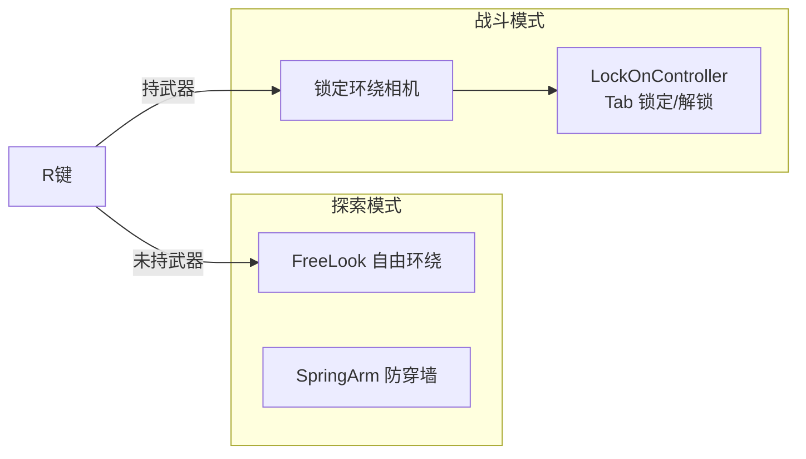
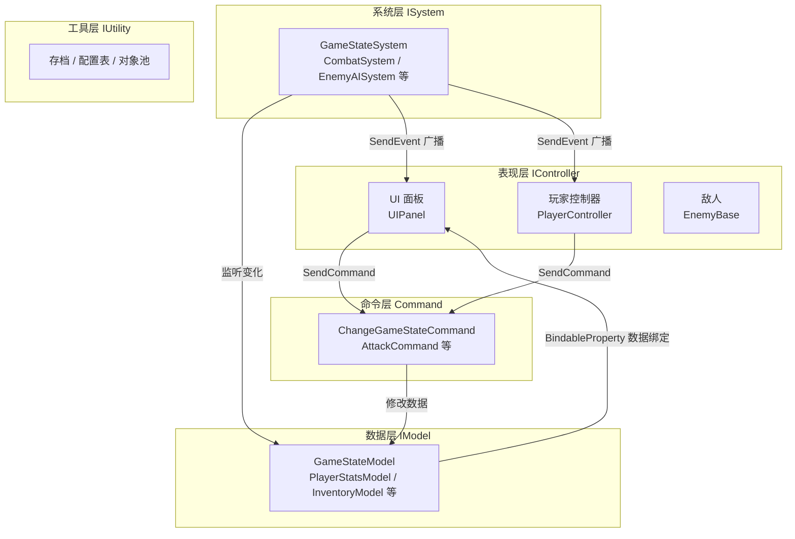
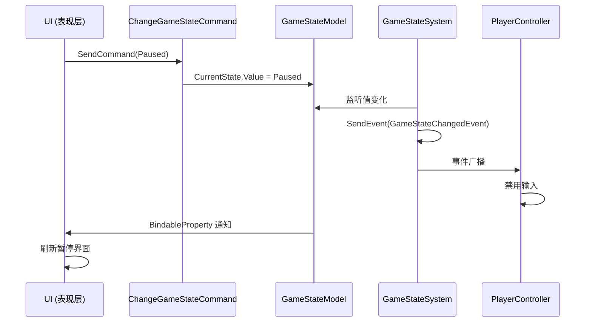

# 🗡️ LowPoly ARPG

> 一个使用 **Unity 6 + QFramework 架构** 开发的低多边形动作角色扮演游戏（ARPG）学习项目
> 用于秋招求职的**功能完整 + 技术演示**作品

---

## 📌 项目定位

- **类型：** 第三人称动作角色扮演游戏（ARPG）
- **美术风格：** Low Poly 低多边形
- **视角：** Cinemachine FreeLook 第三人称自由视角
- **核心目标：** 功能闭环、技术演示、架构清晰，不追求关卡数量

---

## 🛠️ 技术栈

| 类别 | 技术 |
|------|------|
| 引擎 | Unity 6 |
| 渲染管线 | Universal Render Pipeline (URP) |
| 语言 | C# |
| 相机 | **双相机模式**：Cinemachine FreeLook（探索）+ 锁定环绕相机（战斗） |
| 输入 | Input System（键鼠 + 手柄双方案） |
| 角色控制 | CharacterController |
| **游戏架构** | **QFramework（分层架构：Controller / System / Model / Command）** |
| 数据绑定 | QFramework BindableProperty |
| 事件系统 | QFramework 类型事件 + 字符串事件兼容层 |

---

## 🎥 双相机模式（核心玩法亮点）

随武器状态自动切换的两套视角系统，与两套角色动画树（装备/未装备）一一对应：

| 模式 | 触发条件 | 相机行为 | 参考设计 |
|------|---------|---------|---------|
| **探索模式** | 未持武器 | Cinemachine FreeLook 自由环绕 + **SpringArm 防穿墙**（SphereCast 检测遮挡，按比例收缩三环半径） | dbrizov/Unity-CharacterController（MIT） |
| **战斗模式** | 持武器（R 键） | 锁定环绕相机：**Tab 锁定最近敌人**，相机位于"玩家→目标"连线玩家后方，视线看向二者中点；未锁定时为标准越肩相机 | mishanyaqq/Erbium（MIT） |



**联动机制（QFramework 事件驱动）：**
1. 按 R 切换装备 → `PlayerController` 广播 `EquipmentChangedEvent`
2. `CameraModeController` 监听事件 → 切换相机优先级（FreeLook ↔ 战斗相机）
3. `LockOnController` 在摘武器时自动解锁
4. 按 Tab 锁定 → 广播 `LockOnTargetChangedEvent` → 相机环绕目标 + 玩家始终面朝目标

---

## 🏗️ 架构设计（核心亮点）

项目基于开源框架 **[QFramework](https://github.com/liangxiegame/QFramework)（MIT 协议）** 的分层思想构建。
QFramework 核心源码不到 1000 行，我们将它作为架构层引入，并在此之上建立游戏业务的分层体系。

### 四层架构



### 分层规则

| 层级 | 接口/基类 | 职责 | 可以做的事 |
|------|-----------|------|-----------|
| 表现层 | `IController` | 接收输入、表现状态变化 | 获取 System/Model、发送 Command、监听 Event |
| 命令层 | `AbstractCommand` | 封装一次性的行为逻辑（无状态） | 获取 System/Model、发送 Event/Command |
| 系统层 | `AbstractSystem` | 多个表现层共享的逻辑 | 获取 Model、监听/发送 Event |
| 数据层 | `AbstractModel` | 数据存储 + 变化通知 | 发送 Event |
| 工具层 | `IUtility` | 基础设施（存储/序列化等） | — |

**核心约束：**
- ✅ 表现层修改数据**必须走 Command**，禁止直接改 Model
- ✅ 数据变化 → System 通过 **BindableProperty / 事件** 通知表现层
- ✅ 上层可以直接获取下层，下层**不能反向引用**上层

### 一次状态切换的完整事件流



---

## 📁 项目结构

```
Assets/Scripts/
├── Framework/                    # 框架核心
│   ├── QFramework/
│   │   └── QFramework.cs         # QFramework 官方架构核心（MIT，原样引入）
│   ├── GameArchitecture.cs       # 游戏架构入口：注册所有 Model/System/Utility
│   ├── Models/
│   │   └── GameStateModel.cs     # 游戏状态数据（BindableProperty 数据绑定）
│   ├── Systems/
│   │   └── GameStateSystem.cs    # 游戏状态机（数据变化 → 事件广播）
│   ├── Commands/
│   │   └── ChangeGameStateCommand.cs  # 状态切换命令（唯一入口）
│   ├── GameManager.cs            # 架构引导器 + 单例
│   ├── EventManager.cs           # 字符串事件兼容层（新代码推荐类型事件）
│   ├── AudioManager.cs           # 音效/音乐（待迁移为 System）
│   ├── CameraManager.cs          # 相机管理
│   ├── ConfigManager.cs          # 配置表管理
│   ├── CursorManager.cs          # 鼠标锁定/解锁
│   ├── InputManager.cs           # 输入封装（键鼠/手柄）
│   ├── PoolManager.cs            # 对象池
│   ├── SaveManager.cs            # 存档系统
│   ├── SceneLoader.cs            # 场景加载
│   └── UIManager.cs              # UI 面板管理
├── Player/                       # 玩家系统（移动、战斗、属性、背包、技能、任务）
├── Enemy/                        # 敌人系统（AI、属性、刷怪）
├── UI/                           # 界面系统（HUD、背包、技能树、对话、暂停）
├── Combat/                       # 战斗逻辑（伤害计算、Buff、弹道、打击检测）
└── Data/                         # 数据结构定义（物品、技能、敌人配置、存档）
```

---

## 🚀 快速上手：架构使用示例

### 1. 读取数据

```csharp
// 任意 IController / ISystem 内
var state = this.GetModel<GameStateModel>().CurrentState.Value;
```

### 2. 变更数据（必须走 Command）

```csharp
// 表现层禁止直接改 Model，统一通过命令
this.SendCommand(new ChangeGameStateCommand(GameState.Paused));
```

### 3. 监听全局事件（类型安全）

```csharp
public class PlayerController : MonoBehaviour, IController
{
    public IArchitecture GetArchitecture() => GameArchitecture.Interface;

    private void Awake()
    {
        // 对象销毁时自动注销，无需手动管理生命周期
        this.RegisterEvent<GameStateChangedEvent>(OnGameStateChanged)
            .UnRegisterWhenGameObjectDestroyed(gameObject);
    }
}
```

### 4. UI 数据绑定（BindableProperty）

```csharp
// 在 UIPanel 中直接绑定，值变化自动刷新
gameStateModel.CurrentState.Register(state =>
{
    pausePanel.SetActive(state == GameState.Paused);
});
```

### 5. 新建一个业务模块（三步走）

```csharp
// ① Model：定义数据
public class PlayerStatsModel : AbstractModel
{
    public BindableProperty<int> Hp { get; } = new(100);
    protected override void OnInit() { }
}

// ② Command：封装行为
public class TakeDamageCommand : AbstractCommand
{
    private readonly int mDamage;
    public TakeDamageCommand(int damage) => mDamage = damage;
    protected override void OnExecute() =>
        this.GetModel<PlayerStatsModel>().Hp.Value -= mDamage;
}

// ③ 注册进架构
// GameArchitecture.Init() 中：RegisterModel(new PlayerStatsModel());
```

---

## ✅ 开发路线图

### 已完成
- [x] 基础角色移动（CharacterController + Cinemachine FreeLook）
- [x] **QFramework 架构整合**（分层 + 命令 + 事件 + 数据绑定）
- [x] 游戏状态机（Model / System / Command 完整链路）
- [x] 事件系统（类型事件 + 字符串事件兼容层）
- [x] **Input System 整合**（键鼠 + 手柄，编辑器工具一键配置）
- [x] **双相机模式**（探索 FreeLook + 防穿墙 / 战斗锁定环绕 + Tab 锁定）
- [x] 武器切换与双动画树（装备/未装备 Locomotion）
- [x] 重攻击三段连击（输入缓冲 + 连击窗口）

### 进行中
- [ ] 战斗系统（轻攻击连段 / 技能）
- [ ] 敌人 AI（巡逻 / 追击 / 攻击）
- [ ] HUD（血条 / 技能栏）

### 待开发
- [ ] 背包与装备
- [ ] 任务与对话
- [ ] 存档系统
- [ ] 场景搭建与刷怪
- [ ] 音效与音乐
- [ ] 性能优化与打包

---

## 🎯 面试亮点速览

1. **架构设计能力**：基于 QFramework 分层架构，能画出架构图、讲清事件流
2. **低耦合实践**：表现层 → Command → Model → System → 事件 的单向依赖链
3. **类型安全事件**：用编译期检查替代字符串常量，降低拼写错误风险
4. **自动生命周期管理**：`UnRegisterWhenGameObjectDestroyed` 防止事件泄漏
5. **数据驱动 UI**：BindableProperty 让 UI 与数据解耦，改数据自动刷新界面
6. **双相机模式设计**：随武器状态切换视角，借鉴开源项目 SpringArm / 锁定环绕设计
7. **编辑器工具化**：一键生成输入资产、自动配置预制体与动画状态机

---

## 🤖 AI 协作说明

本项目的代码开发大量借助 **GitHub Copilot** 进行：
- 代码框架生成与补全
- 架构设计建议与代码审查
- 文档撰写（README / 开发日志）

在 AI 的协助下可以大幅提高开发效率，但所有生成代码均经过人工审查与验证。

---

## 📄 开源许可

本项目采用 QFramework 作为架构层，遵循其 **MIT 许可证**：
- [QFramework](https://github.com/liangxiegame/QFramework) © liangxiegame

---

*README 最后更新：2026年8月（整合 QFramework 架构）*
